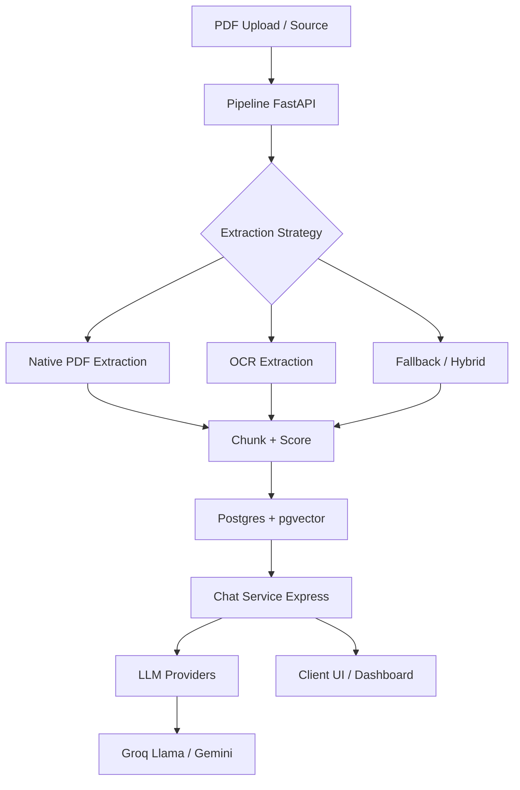

# DocForge

DocForge is a foundation for a multi-strategy PDF ingestion pipeline with a citation-aware chat layer for RAG-based AI products. It is designed to route documents through the right extraction path, score extraction confidence, and preserve citation context for reliable answers.

## Problem Statement

Many enterprise and product use cases need PDF content to be searchable, answerable, and cite-aware. DocForge solves the PDF ingestion problem by building a modular ingestion pipeline, a vector-backed store, and a chat service that can return cited answers for documents at scale.

## Architecture Overview

## Stack

- Python 3.12, FastAPI, Uvicorn
- Node 20, Express
- Postgres 16 with pgvector
- Tesseract OCR + layout extraction strategy
- Groq Llama + Google Gemini for model A/B
- sentence-transformers embeddings
- Streamlit for dashboarding

